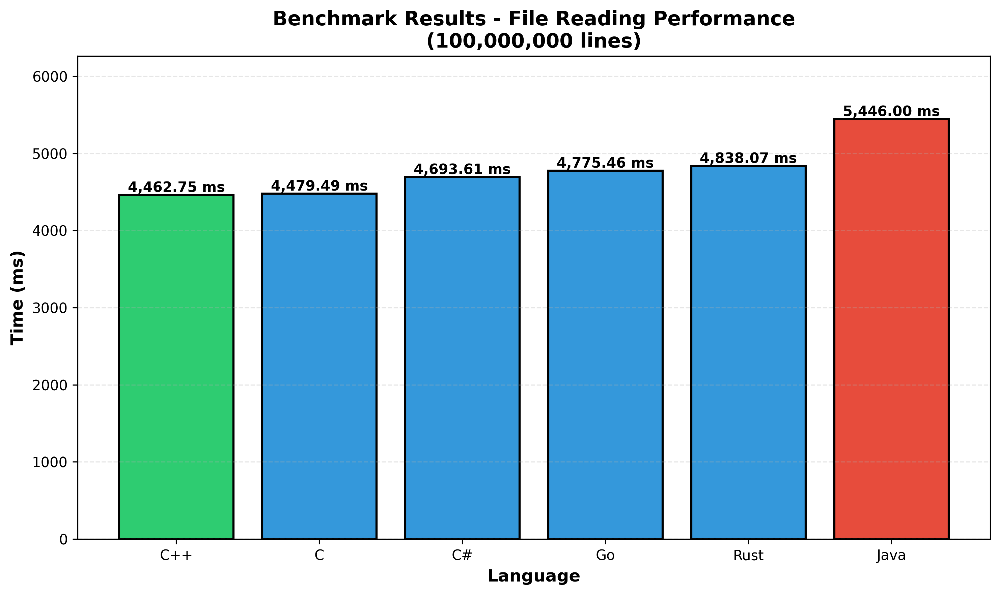
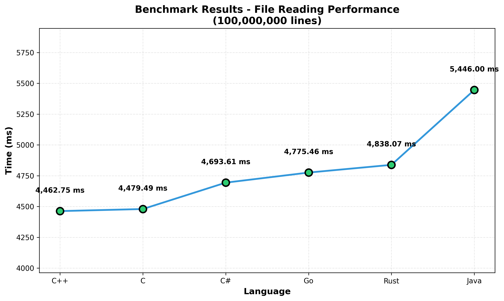

# SWAR 알고리즘 언어별 성능 벤치마크

이 프로젝트는 SWAR (SIMD Within A Register) 알고리즘을 사용하여 대용량 파일에서 줄바꿈 문자를 카운팅하는 작업을 여러 프로그래밍 언어(C, C++, C#, Java, Rust, Go)로 구현하고 성능을 비교합니다.

## SWAR 알고리즘 원리

SWAR (SIMD Within A Register)는 단일 레지스터 내에서 여러 작은 값을 동시에 처리하는 기법입니다. 이 프로젝트에서는 줄바꿈 문자('\n', 0x0A)를 빠르게 카운팅하기 위해 사용됩니다.

### 핵심 동작 방식

```c
// 8바이트를 한 번에 처리
uint64_t chunk = *(const uint64_t *)(buffer + i);

// SWAR 알고리즘
uint64_t x = chunk ^ 0x0A0A0A0A0A0A0A0AUL;  // 1. XOR: 줄바꿈 문자 찾기
x = (x - 0x0101010101010101UL) & ~x & 0x8080808080808080UL;  // 2. 0바이트 검출
count += ((x >> 7) & 0x0101010101010101UL) * 0x0101010101010101UL >> 56;  // 3. 카운팅
```

**단계별 설명:**

1. **XOR 연산**: 각 바이트를 0x0A와 XOR하여 줄바꿈 문자가 있는 위치는 0x00이 됩니다
2. **0바이트 검출**: `(x - 0x01...) & ~x & 0x80...` 패턴을 사용하여 0바이트를 찾습니다
3. **카운팅**: 비트 조작을 통해 8바이트 내의 줄바꿈 수를 한 번에 계산합니다

**성능 이점:**
- 기존 방식: 1바이트씩 비교 → 8번의 연산
- SWAR 방식: 8바이트를 동시에 처리 → 4~5번의 연산으로 8배 처리

## 벤치마크 결과

### 테스트 환경
- 파일 크기: 1.54GB (1,549,032,381 bytes)
- 라인 수: 100,000,000 lines

### 성능 비교 (단위: ms)





### 상세 결과

```
Run C...
File size: 1549032381 bytes
Line count: 100000000
Time: 4479.49 ms
=================================
Run C++...
File size: 1549032381 bytes
Line count: 100000000
Time: 4462.75 ms
=================================
Run C#...
File size: 1549032381 bytes
Line count: 100000000
Time: 4693.61 ms
=================================
Run Go...
File size: 1549032381 bytes
Line count: 100000000
Time: 4775.46 ms
=================================
Run Java...
File size: 1549032381 bytes
Line count: 100000000
Time: 5446.00 ms
=================================
Run Rust...
File size: 1549032381 bytes
Line count: 100000000
Time: 4838.07 ms
=================================
```

**순위:**
1. C++ - 4462.75 ms (가장 빠름)
2. C - 4479.49 ms
3. C# - 4693.61 ms
4. Go - 4775.46 ms
5. Rust - 4838.07 ms
6. Java - 5446.00 ms

## 프로젝트 구조

```
.
├── README.md
├── install.sh                    # 의존성 설치 스크립트
├── build.sh / build.ps1          # 전체 빌드 스크립트
├── run.sh / run.ps1              # 전체 실행 스크립트
├── result.txt                    # 벤치마크 결과
├── benchmark_bar_chart.png       # 바 그래프
├── benchmark_line_chart.png      # 라인 그래프
├── data/
│   └── measurements.csv          # 테스트 데이터
└── src/
    ├── c/                        # C 구현
    ├── cpp/                      # C++ 구현
    ├── csharp/                   # C# 구현
    ├── go/                       # Go 구현
    ├── java/                     # Java 구현
    ├── rust/                     # Rust 구현
    ├── benchmark_graph.py        # 그래프 생성 스크립트
    └── generator.py              # 테스트 데이터 생성 스크립트
```

## 설치 및 실행

### 1. 의존성 설치

**Linux/Ubuntu:**
```bash
chmod +x install.sh
./install.sh
```

`install.sh`는 다음 패키지를 설치합니다:
- gcc, g++ (C/C++ 컴파일러)
- rustc (Rust 컴파일러)
- openjdk-21-jdk-headless (Java)
- golang-go (Go 컴파일러)
- dotnet-sdk-8.0 (C# .NET SDK)
- python3-pip (Python)

### 2. 테스트 데이터 생성

```bash
cd src
python3 generator.py 100000000
```

`generator.py`는 가상의 기상 관측소 데이터를 생성합니다:
- 660개의 전 세계 도시에서 온도 측정값 생성
- 형식: `도시명;온도` (예: "Seoul;12.5")
- 진행률을 10% 단위로 표시
- 생성 시간과 통계 출력

### 3. 전체 빌드

**Linux/macOS:**
```bash
chmod +x build.sh
./build.sh
```

**Windows (PowerShell):**
```powershell
.\build.ps1
```

`build.sh`는 모든 언어의 소스를 순차적으로 빌드합니다. 각 언어별 폴더의 `build.sh`를 실행합니다.

### 4. 벤치마크 실행

**Linux/macOS:**
```bash
chmod +x run.sh
./run.sh > result.txt
```

**Windows (PowerShell):**
```powershell
.\run.ps1 > result.txt
```

`run.sh`는 모든 언어의 벤치마크를 순차적으로 실행하고 결과를 출력합니다.

### 5. 결과 시각화

```bash
cd src
python3 benchmark_graph.py ../result.txt
```

`benchmark_graph.py`는 벤치마크 결과를 분석하여:
- 바 차트 생성 (benchmark_bar_chart.png)
- 라인 차트 생성 (benchmark_line_chart.png)
- 통계 출력 (가장 빠른/느린 언어, 평균, 상대 성능)

## 언어별 빌드 및 실행

각 언어별 폴더(`src/c`, `src/cpp`, 등)에는 개별 `build.sh`/`build.ps1`과 `run.sh`/`run.ps1` 스크립트가 있습니다.

### C (`src/c/`)

**빌드 (`build.sh`):**
```bash
gcc -O3 -march=native -flto -ffast-math main.c -o main
```

**실행 (`run.sh`):**
```bash
time ./main ../../data/measurements.csv
```

### C++ (`src/cpp/`)

**빌드 (`build.sh`):**
```bash
g++ -O3 -march=native -flto -ffast-math main.cpp -o main
```

**실행 (`run.sh`):**
```bash
time ./main ../../data/measurements.csv
```

### C# (`src/csharp/`)

**빌드 (`build.sh`):**
```bash
dotnet publish -c Release -f net8.0 -r linux-x64
```

**실행 (`run.sh`):**
```bash
time ./bin/Release/net8.0/linux-x64/publish/main ../../data/measurements.csv
```

### Go (`src/go/`)

**빌드 (`build.sh`):**
```bash
CGO_ENABLED=0 go build -ldflags="-s -w" -o main main.go
```

**실행 (`run.sh`):**
```bash
time ./main ../../data/measurements.csv
```

### Java (`src/java/`)

**빌드 (`build.sh`):**
```bash
javac Main.java
```

**실행 (`run.sh`):**
```bash
time java -XX:+UseG1GC -XX:+AlwaysPreTouch Main ../../data/measurements.csv
```

### Rust (`src/rust/`)

**빌드 (`build.sh`):**
```bash
rustc -O -C target-cpu=native -C lto=fat -C codegen-units=1 main.rs -o main
```

**실행 (`run.sh`):**
```bash
time ./main ../../data/measurements.csv
```

---

## 최적화된 빌드 명령어

> **주의**: 각 언어의 설치 방법은 공식 사이트나 공개된 문서를 통해 진행해주시기 바랍니다.
> - C/C++: https://gcc.gnu.org, https://clang.llvm.org
> - C#: https://dotnet.microsoft.com
> - Java: https://www.java.com
> - Rust: https://www.rust-lang.org
> - Go: https://golang.org

## C (원본 코드)
```bash
# GCC 최적화 빌드
gcc -O3 -march=native -flto -ffast-math main.c -o main

# Clang 최적화 빌드
clang -O3 -march=native -flto -ffast-math main.c -o main

# 모든 최적화 포함 + 경고
gcc -O3 -march=native -flto -ffast-math -Wall -Wextra main.c -o main

# 실행
./main <file>
```

## C++ (main.cpp)
```bash
# GCC 최적화 빌드
g++ -O3 -march=native -flto -ffast-math main.cpp -o main

# Clang 최적화 빌드
clang++ -O3 -march=native -flto -ffast-math main.cpp -o main

# 모든 최적화 포함
g++ -O3 -march=native -flto -ffast-math -Wall -Wextra main.cpp -o main
```

## C# (main.cs)
```bash
# Release 모드 빌드
csc -optimize+ main.cs

# .NET Core (dotnet CLI)
dotnet new console -n NewlineCounter
# Program.cs에 코드 붙여넣기
dotnet publish -c Release -f net8.0 -r linux-x64

# 실행
./bin/Release/net8.0/linux-x64/NewlineCounter <file>
```

## Java (Main.java)
```bash
# 컴파일
javac Main.java

# 최적화 설정으로 실행
java -XX:+UseG1GC -XX:MaxGCPauseMillis=200 -XX:+UnlockExperimentalVMOptions Main <file>

# 더 빠른 실행 (OpenJDK)
java -server -XX:+UseG1GC -XX:+AlwaysPreTouch Main <file>
```

## Rust (main.rs)
```bash
# Release 빌드 (최고 최적화)
rustc -O -C target-cpu=native -C lto=fat -C codegen-units=1 main.rs -o main

# Cargo 프로젝트 (추천)
cargo new --bin newline_counter
# Cargo.toml 설정:
# [profile.release]
# opt-level = 3
# lto = "fat"
# codegen-units = 1
# strip = true

cargo build --release
./target/release/main <file>
```

## Go (main.go)
```bash
# 최적화 빌드
go build -ldflags="-s -w" -o main main.go

# 더 빠른 빌드 (Go 1.21+)
go build -ldflags="-s -w" -trimpath -o main main.go

# CGO 비활성화 (더 빠름)
CGO_ENABLED=0 go build -ldflags="-s -w" -o main main.go

# 크로스 컴파일 (Linux 64-bit)
GOOS=linux GOARCH=amd64 CGO_ENABLED=0 go build -ldflags="-s -w" -o main main.go
```

---

## 최적화 플래그 설명

### 공통
- `-O3` / `-O`: 최고 레벨 최적화
- `-march=native`: CPU 네이티브 명령어 사용
- `-flto` / `lto=fat`: 링크 타임 최적화

### C++
- `-ffast-math`: 빠른 수학 연산 (정확도 약간 감소)
- `-Wall -Wextra`: 모든 경고 표시

### Rust
- `opt-level = 3`: 최고 최적화
- `codegen-units = 1`: 단일 코드젠 유닛 (더 느린 컴파일, 더 빠른 실행)
- `strip = true`: 디버그 심볼 제거

### Go
- `-ldflags="-s -w"`: 심볼/DWARF 테이블 제거 (파일 크기 감소)
- `-trimpath`: 빌드 경로 제거
- `CGO_ENABLED=0`: C 라이브러리 비활성화
